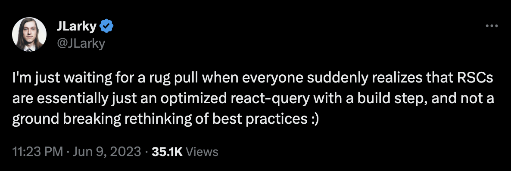
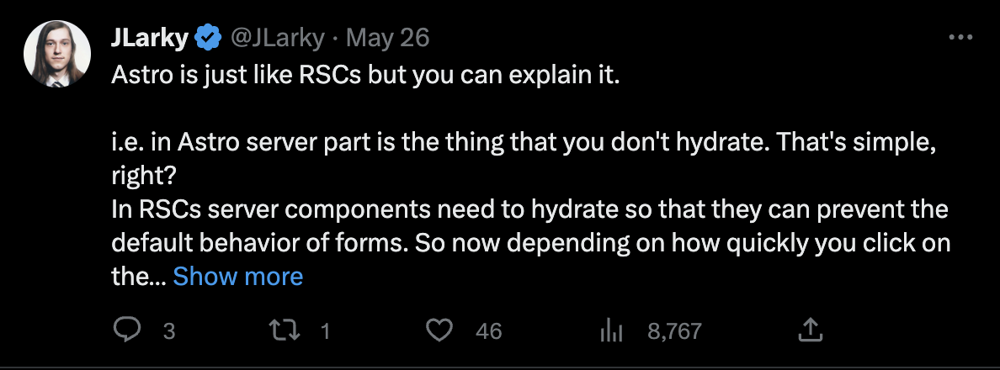
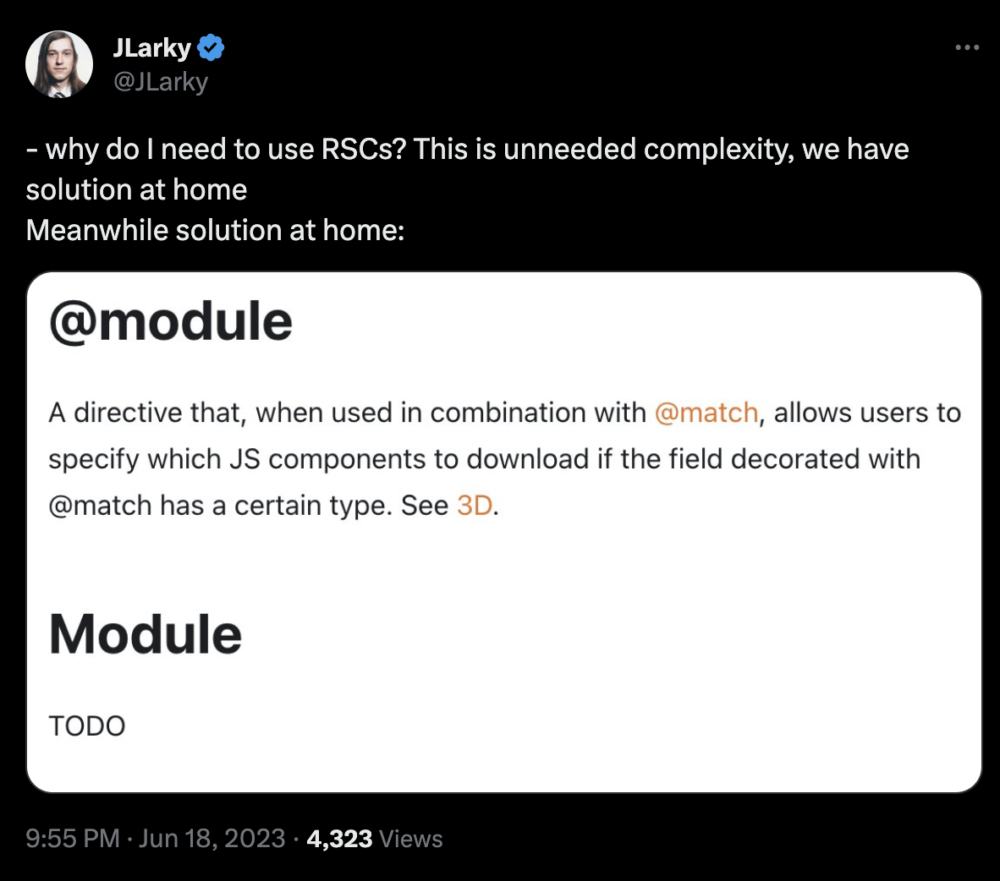

# A word of caution

Beware of people who are saying *RSCs are just X*. Depending on how you slice it, it could be something very similar to what you already did, or it could be basically a new universe of things you never knew you needed.

# RSCs are just React Query

https://twitter.com/JLarky/status/1667402037326401536

# RSCs are just islands

https://twitter.com/JLarky/status/1662297676149567488

# RSCs are just GraphQL

https://twitter.com/JLarky/status/1648938495921012737

# RSCs are just Relay

https://twitter.com/JLarky/status/1670641519072792587
