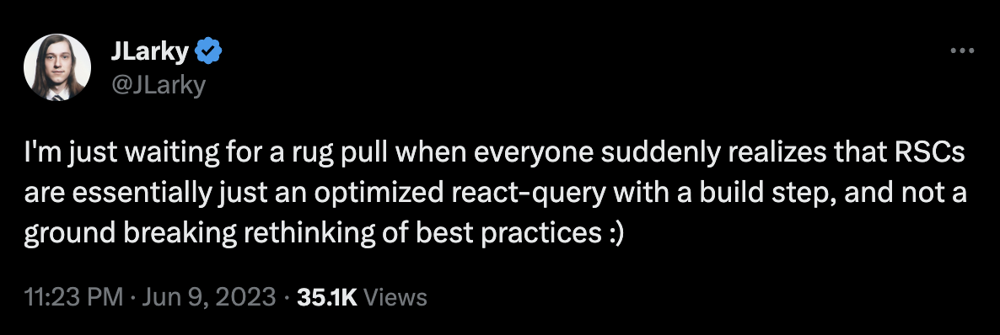
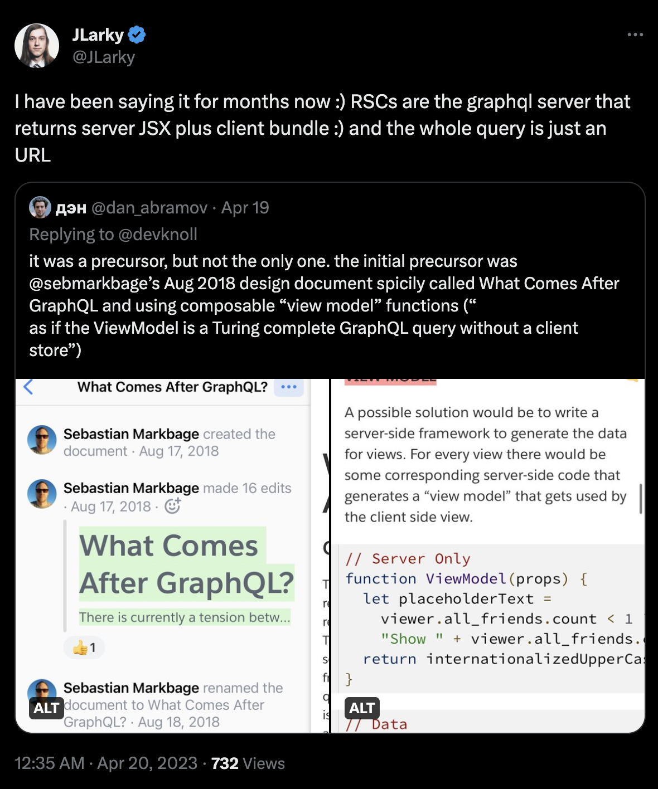

# A word of caution

Beware of people who are saying _RSCs are just X_.

Depending on how you slice it, it could be something very similar to what you already did, or it could be, basically, a new universe of things you never knew you needed.

# RSCs are just React Query

https://twitter.com/JLarky/status/1667402037326401536

# RSCs are just islands

https://twitter.com/JLarky/status/1662297676149567488

# RSCs are just GraphQL

https://twitter.com/JLarky/status/1648938495921012737

# RSCs are just Relay

https://twitter.com/JLarky/status/1670641519072792587

# Take away

What that means is that everyone who talks about RSCs is going to cover only a tiny aspect of the whole thing. And that's okay, not everyone cares about everything.

This also is true about critics. They are usually focused on one tiny aspect and are trying to argue that the whole thing should be thrown away because of that.
