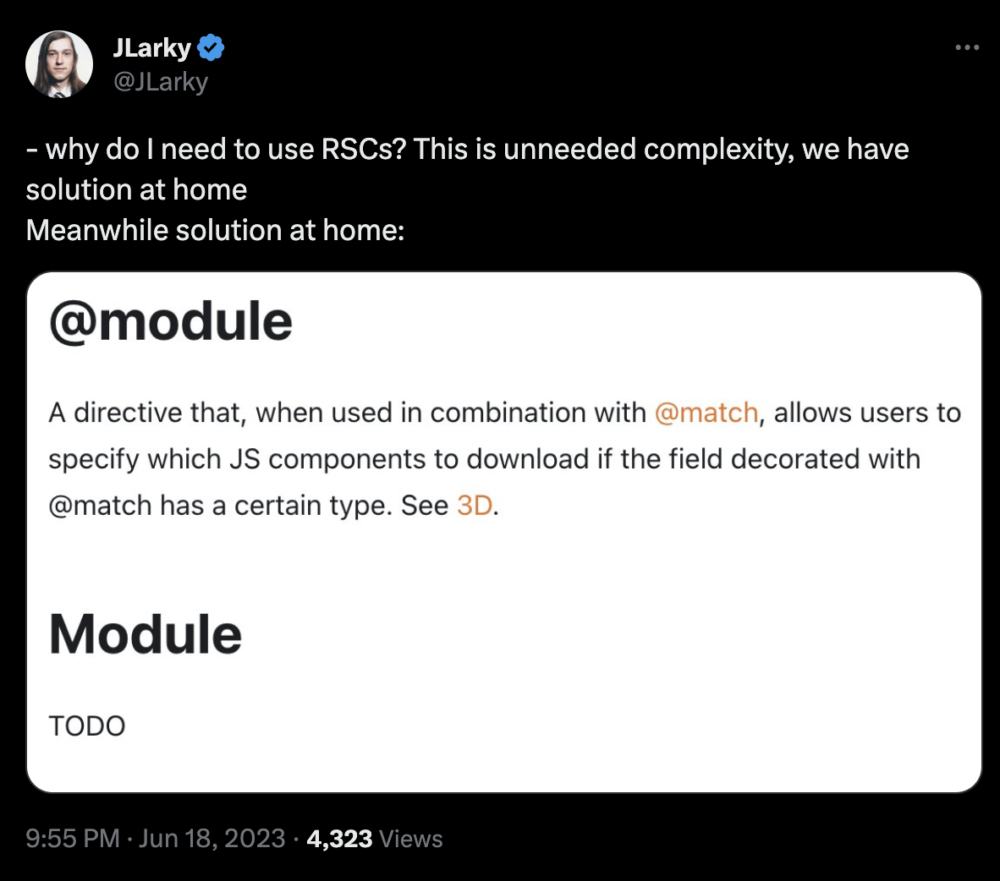

First way of looking at RSCs (optimized client bundles)

I feel like that was the main takeaway from the interview Kent did with React team https://www.youtube.com/watch?v=h7tur48JSaw

So let's talk about that.

In the beginning there was SPA with `<div id="root"></div>`

# SSR

Imagine you are a website with thousands of pages, like an e-commerce website. With different products, admin pages, etc. Knowing the URL you don't want to over-fetch you data, you also want to avoid the waterfall of requests. But you also don't want to over-fetch the amount of JS that is required for the page. First easy fix is to split your bundles by page. But you get every component that could be used on that page, it doesn't depend on the data.

<!-- That's where we see `<Suspense>` and `React.lazy` for the first time. -->

# React Relay

Now imagine you are Facebook. You have the Feed. It's right there on the route `/`. It can contain countless variations of posts, each of them is implemented as a separate component. How do you not over-fetch your JS bundle? You create the most complicated and impossible to use product called Relay.

Sure it was out since 2016. Have you seen anyone use it? Do you know what the docs for that code splitting feature look like?



https://twitter.com/JLarky/status/1670641519072792587

# Example

So here if the response contains some data of type `SomeType` Relay will load the `SomeComponent` bundle together with the data.

```tsx
import React from "react";
import { graphql } from "react-relay/hooks";
import SomeComponent from "./SomeComponent";

export const frag = graphql`
  fragment SomeComponentFragment on SomeType 
  @module(name: "SomeComponent") {
    # Define fields here
  }
`;
```

_I asked GPT-4 to come up with an example, I have no intention to check if that's how it actually works_

# RSCs

<!-- That's where we see `<Suspense>` on the server for the first time. -->

RSCs is anoter Facebook's attempt to solve "Data-Driven Dependencies" problem. Let's look at [simple example](./demos/next-app/src/pages/bundle.tsx).

```tsx
"use server";
import { HeavyComponent } from "~/ui/HeavyComponent";

export default function Home() {
  return (
    <div>
      {0 && <HeavyComponent />}
    </div>
  );
}
```

It seems obvious that that we don't want to include `HeavyComponent` in the client bundle here. But it only works like that if you import it from Server Components. Thus with RSCs there are no waterfalls (compared to React.lazy), and no over-fetching (compared to SSR) no matter how deeply nested your server components are.

And of course it can do this more intelligently like importing a module only if user has the right A/B test enabled, etc. See [RSCs example](./demos/next-app/src/app/bundle/rsc/page.tsx).
